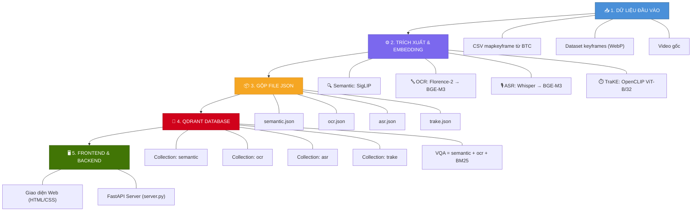

<h1 align="center">
  🚀 AI Multimodal Video Retrieval System
</h1>

<p align="center">
  <strong>Hệ thống Truy xuất Video & Keyframe Đa phương thức thông minh cho AI Challenge (AIC)</strong>
</p>

<p align="center">
  
  
  
  
  
</p>

<p align="center">
  Phục vụ các bài toán <strong>tìm kiếm khung hình</strong>, <strong>hỏi đáp thị giác</strong> và <strong>truy vết chuỗi sự kiện theo trục thời gian</strong> trong các kỳ thi AI Challenge (AIC).
</p>

---

## 📑 Mục lục

- [📂 Cấu trúc Dự án](#-cấu-trúc-dự-án)
- [⚡ Cài đặt & Khởi động Nhanh](#-cài-đặt--khởi-động-nhanh)
- [🌟 Tính năng Chính](#-tính-năng-chính)
- [🧠 Mô hình AI sử dụng](#-mô-hình-ai-sử-dụng)
- [🔄 Workflow Hệ thống](#-workflow-hệ-thống)
- [🛠️ Công cụ & Kiểm thử](#️-công-cụ--kiểm-thử)
- [📦 Dataset](#-dataset)

---

## 📂 Cấu trúc Dự án

```
multimodal-retrieval/
│
├── 🚀 Core ─────────────────────────────────────────────────
│   ├── server.py                 # FastAPI Backend Server chính
│   ├── index.html                # Giao diện Web HTML chính
│   ├── style.css                 # Stylesheet giao diện Web
│   └── config.py                 # Quản lý cài đặt, đường dẫn & Model
│
├── 🧠 services/ ─────────────────────────────────────────────
│   ├── semantic_service.py       # Trích xuất vector ngữ nghĩa (SigLIP)
│   ├── ocr_service.py            # Trích xuất OCR (Florence-2 Large + BGE-M3)
│   ├── asr_service.py            # Trích xuất giọng nói (Whisper Large V3 + BGE-M3)
│   ├── vqa_service.py            # Hỏi đáp ảnh (Multimodal RAG + BM25)
│   └── trake_service.py          # Truy vết chuỗi sự kiện (OpenCLIP ViT-B/32)
│
├── 🛠️ scripts/ ──────────────────────────────────────────────
│   ├── dataset_manifest.py       # Quét & tạo manifest thống kê toàn bộ dataset
│   ├── kis_healthcheck.py        # Kiểm tra sức khỏe Qdrant & độ dài vector
│   ├── kis_evaluation.py         # Chấm điểm Recall@k (R@1, 5, 20, 50, 100)
│   └── make_embeddings.py        # Gộp embedding thành file JSON duy nhất
│
├── 🧪 tests/ ────────────────────────────────────────────────
│   ├── test_database.py          # Test kết nối & vector search trên Qdrant
│   ├── test_services.py          # Test trích xuất vector từ các model
│   └── test_vqa.py               # Test luồng hỏi đáp VQA
│
└── 📦 Data & Storage ────────────────────────────────────────
    ├── mapkeyframe/              # CSV mapkeyframe (pts_time, n, frame_idx)
    ├── uploads/                  # Ảnh keyframes & video gốc
    └── *.json                    # 4 file JSON gộp (semantic, ocr, asr, trake)
```

---

## ⚡ Cài đặt & Khởi động Nhanh

### Yêu cầu hệ thống

| Thành phần | Yêu cầu tối thiểu |
|---|---|
| **Python** | 3.10+ |
| **GPU** | NVIDIA GPU với CUDA (khuyến nghị) |
| **RAM** | 16 GB+ |
| **Qdrant** | v1.7+ (chạy local, không cần Docker) |

### Bước 1 — Cài đặt Qdrant Local (Standalone Binary)

1. Tải bản release mới nhất từ [**Qdrant GitHub Releases**](https://github.com/qdrant/qdrant/releases).
2. Giải nén vào thư mục trên máy (ví dụ: `C:\qdrant` hoặc `/opt/qdrant`).
3. Khởi chạy Qdrant:

```powershell
# Windows
.\qdrant.exe

# Linux / macOS
./qdrant
```

> ✅ Qdrant sẽ chạy tại **http://localhost:6333**

### Bước 2 — Kích hoạt môi trường ảo & cài đặt thư viện

```powershell
# Tạo và kích hoạt virtualenv
python -m venv venv
.\venv\Scripts\Activate.ps1        # Windows PowerShell
# source venv/bin/activate         # Linux / macOS

# Cài đặt các thư viện cần thiết
pip install torch torchvision transformers sentence-transformers \
            qdrant-client fastapi uvicorn pillow \
            open-clip-torch openai-whisper rank_bm25
```

### Bước 3 — Khởi chạy Backend Server

```powershell
python server.py
```

> 🌐 Mở trình duyệt truy cập `index.html` hoặc URL từ server để sử dụng giao diện.

---

## 🌟 Tính năng Chính

| Tab | Tính năng | Mô tả |
|:---:|---|---|
| 🔍 | **Semantic Search** | Nhập từ khóa truy vấn ngữ nghĩa → Trả về keyframes có độ tương đồng cao nhất qua **SigLIP** |
| 🔤 | **OCR Search** | Nhập văn bản hoặc kéo thả ảnh → Tìm keyframes chứa nội dung văn bản tương đồng qua **Florence-2 Large** + **BGE-M3** |
| 🎙️ | **ASR Search** | Nhập từ khóa lời thoại → Tìm keyframes từ giọng nói trích xuất qua **Whisper Large V3** + **BGE-M3** |
| 🤖 | **VQA** | Hỏi đáp thị giác → Multimodal RAG kết hợp **SigLIP** + **Florence-2** + **BM25 Reranking** |
| ⏱️ | **TraKE** | Nhập chuỗi sự kiện (E1→E2→E3→E4) → Truy vết khoảnh khắc tăng dần theo thời gian qua **OpenCLIP ViT-B/32** |
| 🎥 | **Keyframe Inspector** | Xem chi tiết Frame ID, pts_time, đường dẫn ảnh & trình phát video tự động tua đến đúng giây |

---

## 🧠 Mô hình AI sử dụng

| Mô hình | Vai trò | Kích thước Vector |
|---|---|:---:|
| **SigLIP** | Trích xuất ngữ nghĩa hình ảnh (Semantic Embedding) | — |
| **Florence-2 Large** | Nhận diện văn bản / OCR trong ảnh | — |
| **BGE-M3** | Mã hóa văn bản thành vector đa ngôn ngữ (OCR & ASR) | — |
| **Whisper Large V3** | Chuyển đổi giọng nói thành văn bản (Speech-to-Text) | — |
| **OpenCLIP ViT-B/32** | Trích xuất đặc trưng chuỗi sự kiện theo thời gian | — |
| **BM25** | Reranking kết quả trong luồng VQA | — |

---

## 🔄 Workflow Hệ thống



### Luồng xử lý chi tiết

```
┌─────────────────────────────────────────────────────────────────────┐
│  1. DỮ LIỆU ĐẦU VÀO                                               │
│     └── CSV mapkeyframe (pts_time, n, frame_idx)                    │
│     └── Dataset keyframes (.webp) + Video gốc                      │
├─────────────────────────────────────────────────────────────────────┤
│  2. TRÍCH XUẤT & EMBEDDING                                          │
│     ├── Semantic  → SigLIP                                          │
│     ├── OCR       → Florence-2 Large → BGE-M3                      │
│     ├── ASR       → Whisper Large V3 (ngắt quãng ≤1s) → BGE-M3    │
│     └── TraKE     → OpenCLIP ViT-B/32                               │
├─────────────────────────────────────────────────────────────────────┤
│  3. GỘP NHÓM → 4 FILE JSON DUY NHẤT                                │
│     semantic.json │ ocr.json │ asr.json │ trake.json                │
├─────────────────────────────────────────────────────────────────────┤
│  4. ĐẨY LÊN QDRANT LOCAL → 4 Collections riêng biệt               │
│     VQA sử dụng kết hợp collection semantic + ocr + BM25 Reranking │
├─────────────────────────────────────────────────────────────────────┤
│  5. TRUY VẤN → Web UI ↔ FastAPI Server ↔ Qdrant → Kết quả         │
└─────────────────────────────────────────────────────────────────────┘
```

---

## 🛠️ Công cụ & Kiểm thử

### Kiểm tra sức khỏe hệ thống

```powershell
# Kiểm tra sức khỏe Qdrant và độ dài vector các model
python scripts/kis_healthcheck.py

# Tạo manifest thống kê toàn bộ dataset
python scripts/dataset_manifest.py

# Chấm điểm Recall@k
python scripts/kis_evaluation.py
```

### Chạy bộ kiểm thử

```powershell
# Kiểm tra kết nối Qdrant và collections (semantic, ocr, asr, trake)
python tests/test_database.py

# Kiểm tra trích xuất đặc trưng từ các model chuyên biệt
python tests/test_services.py

# Kiểm tra luồng RAG và BM25 Reranking
python tests/test_vqa.py
```

---

## 📦 Dataset

| Nguồn | Link |
|---|---|
| **Keyframes (WebP)** | [Kaggle — AIC2026 Dataset](https://www.kaggle.com/datasets/thinhunguyn/aic2026) |
| **Video gốc** | [Google Drive](https://drive.google.com/file/d/171nciyprX-2V00WSKhi85m2GRKM-XY7c/view) |

---

<p align="center">
  <sub>Made with ❤️ for AI Challenge Vietnam</sub>
</p>
